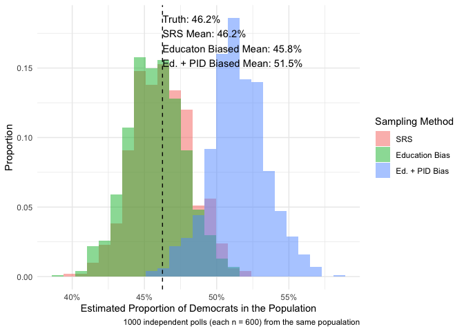

<!-- README.md is generated from README.Rmd. Please edit that file -->

The goal of `svysim` is to facilitate creating realistic simulations of
(biased) survey sampling.

*Abstract*: Surveys are used to teach sampling distributions and
selection biases all the time, but illustrating a sampling distribution
is difficult (because often we only have one survey) and most
simulations are unrealistic (because they draw from a population with
uncorrelated random variables, or because they assume a simple random
sample from that population. This package provides some ready-made
datasets from the CCES and Census-related datasets along with some
customizable sampling schemes, using DeclareDesign.

## Installation

``` r
remotes::install_github("kuriwaki/svysim")
```

## Usage Example

Make a population dataset that expands the common sample via weights.
Though the weights are not frequency weights, we treat it as such for
simplicity.

``` r
pop_wtd <- pop_cces %>% 
  mutate(weight_rounded = ceiling(weight_cumulative)) %>% 
  tidyr::uncount(weights = weight_rounded)

pop_wtd
#> # A tibble: 611,434 x 13
#>     year case_id weight weight_cumulati… state cd     gender    educ    race
#>    <dbl> <chr>    <dbl>            <dbl> <chr> <chr> <dbl+l> <dbl+l> <int+l>
#>  1  2007 605      0.379             1.24 New … NY-15 1 [Mal… 4 [Pos… 1 [Whi…
#>  2  2007 605      0.379             1.24 New … NY-15 1 [Mal… 4 [Pos… 1 [Whi…
#>  3  2007 612      0.995             3.26 Kans… KS-01 2 [Fem… 2 [Som… 1 [Whi…
#>  4  2007 612      0.995             3.26 Kans… KS-01 2 [Fem… 2 [Som… 1 [Whi…
#>  5  2007 612      0.995             3.26 Kans… KS-01 2 [Fem… 2 [Som… 1 [Whi…
#>  6  2007 612      0.995             3.26 Kans… KS-01 2 [Fem… 2 [Som… 1 [Whi…
#>  7  2007 627      0.379             1.24 Cali… CA-52 2 [Fem… 4 [Pos… 1 [Whi…
#>  8  2007 627      0.379             1.24 Cali… CA-52 2 [Fem… 4 [Pos… 1 [Whi…
#>  9  2007 674      0.379             1.24 Texas TX-14 2 [Fem… 2 [Som… 1 [Whi…
#> 10  2007 674      0.379             1.24 Texas TX-14 2 [Fem… 2 [Som… 1 [Whi…
#> # … with 611,424 more rows, and 4 more variables: age <dbl>, age_bin <int+lbl>,
#> #   newsint <dbl+lbl>, pid3_leaner <dbl+lbl>
```

Declare it formally as a population using the `DeclareDesign` package.

``` r
popn <- DeclareDesign::declare_population(pop_cces)
```

Pick a propensity score. For example to oversample highly educated, the
true propensity score we chose is:

``` r
pscore_highed <- p_highed(pop_wtd)
pscore_eddem <- p_eddem(pop_wtd)
```


Take Samples, e.g. a 0.1 percent sample with no replacement

``` r
stat_dem(pop_wtd) # true value
#> [1] 0.4625601

samp0  <- samp_with(pop_wtd, sample_srs, n = 600)
stat_dem(samp0)
#> [1] 0.4783333

samp1  <- samp_with(pop_wtd, sample_highed, n = 600)
stat_dem(samp1)
#> [1] 0.465

samp2  <- samp_with(pop_wtd, sample_eddem, n = 600)
stat_dem(samp2)
#> [1] 0.4333333
```

Take Multiple Samples. This will take several minutes depending on how
many independent samples we draw.

``` r
pop_mu <- stat_dem(pop_wtd)
n_surveys <- 500
n_samp <- 600
samps0 <- map_dbl(1:n_surveys, ~ stat_dem(samp_with(pop_wtd, sample_srs, n_samp)))
samps1 <- map_dbl(1:n_surveys, ~ stat_dem(samp_with(pop_wtd, sample_highed, n_samp)))
samps2 <- map_dbl(1:n_surveys, ~ stat_dem(samp_with(pop_wtd, sample_eddem, n_samp)))
```

Plot the Sampling Distributions

``` r
library(scales)
library(glue)

sampling_df <- bind_rows(
  tibble(method = "SRS", muhat = samps0),
  tibble(method = "Education Bias", muhat = samps1),
  tibble(method = "Ed. + PID Bias", muhat = samps2),
) %>% 
  mutate(method = fct_inorder(method))

txt <- glue("Truth: {percent(pop_mu, accuracy = 0.1)}\n",
             "SRS Mean: {percent(mean(samps0), accuracy = 0.1)}\n",
             "Educaton Biased Mean: {percent(mean(samps1), accuracy = 0.1)}\n",
            "Ed. + PID Biased Mean: {percent(mean(samps2), accuracy = 0.1)}")

sampling_df %>%
  ggplot(aes(x = muhat, fill = method)) +
  geom_histogram(alpha = 0.5, 
                 aes(y = stat(width*density)), 
                 position = position_identity(),
                 bins = 25) +
  geom_vline(xintercept = pop_mu, linetype = "dashed") +
  annotate("text", x = pop_mu, y = Inf, label = txt, 
           hjust = 0, vjust = 1.2) +
  theme_minimal() +
  scale_x_continuous(labels = percent_format(accuracy = 1)) +
  labs(x = "Estimated Proportion of Democrats in the Population",
       fill = "Sampling Method",
       y = "Proportion",
       caption = glue("{n_surveys} independent polls (each n = {n_samp}) from the same popualation"))
```



# Related Packages

  - `kuriwaki/ccesMRPprep`
  - `kuriwaki/ddi`
  - `kuriwaki/sparseregMRP`
  - `kuriwaki/synthArea`
