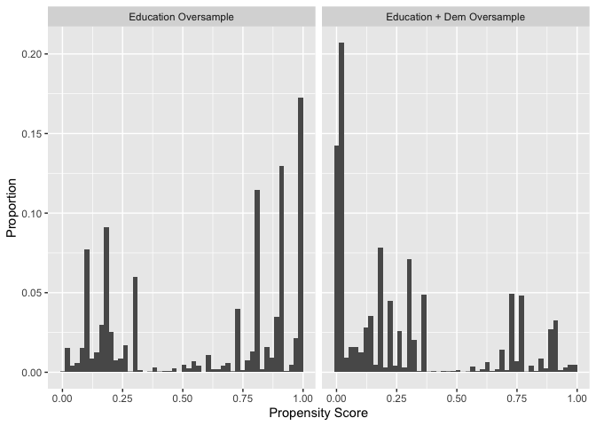

<!-- README.md is generated from README.Rmd. Please edit that file -->

*Abstract*: Surveys are used to teach sampling distributions and
selection biases all the time, but illustrating a sampling distribution
is difficult (because often we only have one survey) and most
simulations are unrealistic. This package provides some ready-made
datasets from the CCES and Census-related datasets along with some
customizable sampling schemes, using DeclareDesign.

The goal of `svysim` is to facilitate creating realistic simulations of
(biased) survey sampling.

## Installation

``` r
remotes::install_github("kuriwaki/svysim")
```

## Usage Example

Make a population dataset that expands the common sample via weights.
Though the weights are not frequency weights, we treat it as such for
simplicity.

``` r
pop_wtd <- pop_cces %>% 
  mutate(weight_rounded = ceiling(weight_cumulative)) %>% 
  tidyr::uncount(weights = weight_rounded)

pop_wtd
#> # A tibble: 611,434 x 13
#>     year case_id weight weight_cumulati… state cd     gender    educ    race
#>    <dbl> <chr>    <dbl>            <dbl> <chr> <chr> <dbl+l> <dbl+l> <int+l>
#>  1  2007 605      0.379             1.24 New … NY-15 1 [Mal… 4 [Pos… 1 [Whi…
#>  2  2007 605      0.379             1.24 New … NY-15 1 [Mal… 4 [Pos… 1 [Whi…
#>  3  2007 612      0.995             3.26 Kans… KS-01 2 [Fem… 2 [Som… 1 [Whi…
#>  4  2007 612      0.995             3.26 Kans… KS-01 2 [Fem… 2 [Som… 1 [Whi…
#>  5  2007 612      0.995             3.26 Kans… KS-01 2 [Fem… 2 [Som… 1 [Whi…
#>  6  2007 612      0.995             3.26 Kans… KS-01 2 [Fem… 2 [Som… 1 [Whi…
#>  7  2007 627      0.379             1.24 Cali… CA-52 2 [Fem… 4 [Pos… 1 [Whi…
#>  8  2007 627      0.379             1.24 Cali… CA-52 2 [Fem… 4 [Pos… 1 [Whi…
#>  9  2007 674      0.379             1.24 Texas TX-14 2 [Fem… 2 [Som… 1 [Whi…
#> 10  2007 674      0.379             1.24 Texas TX-14 2 [Fem… 2 [Som… 1 [Whi…
#> # … with 611,424 more rows, and 4 more variables: age <dbl>, age_bin <int+lbl>,
#> #   newsint <dbl+lbl>, pid3_leaner <dbl+lbl>
```

Declare it formally as a population using the `DeclareDesign` package.

``` r
popn <- DeclareDesign::declare_population(pop_cces)
```

Pick a propensity score. For example to oversample highly educated, the
true propensity score we chose is:

``` r
pscore <- p_highed(pop_wtd)
```



Take Samples

``` r
popn <- declare_population(pop_wtd)
stat_dem(pop_cces) # true value
#> [1] 0.4655933

samp0  <- draw_data(popn + declare_sampling(handler = sample_srs, n = 1000))
stat_dem(samp0)
#> [1] 0.468

samp1  <- draw_data(popn + declare_sampling(handler = sample_highed, n = 1000))
stat_dem(samp1)
#> [1] 0.463
```

Take Multiple Samples. This will take several minutes depending on how
many independent samples we draw.

``` r
pop_mu <- stat_dem(pop_wtd)
samps0 <- map_dbl(1:1000, ~ stat_dem(samp_with(popn, sample_srs, 1000)))
samps1 <- map_dbl(1:1000, ~ stat_dem(samp_with(popn, sample_highed, 1000)))
```

Plot the Sampling Distributions

``` r
library(scales)
library(glue)

sampling_df <- bind_rows(
  tibble(method = "SRS", muhat = samps0),
  tibble(method = "Biased", muhat = samps1),
)

txt <- glue("Truth: {percent(pop_mu, accuracy = 0.1)}\n",
             "SRS Mean: {percent(mean(samps0), accuracy = 0.1)}\n",
             "Biased Mean: {percent(mean(samps1), accuracy = 0.1)}")

sampling_df %>%
  ggplot(aes(x = muhat, fill = method)) +
  geom_histogram(alpha = 0.5, 
                 aes(y = stat(width*density)), 
                 position = position_identity(),
                 bins = 25) +
  geom_vline(xintercept = pop_mu, linetype = "dashed") +
  annotate("text", x = Inf, y = Inf, label = txt, hjust = 1.2, vjust = 1.2) +
  theme_minimal() +
  scale_x_continuous(labels = percent_format(accuracy = 1)) +
  labs(x = "Estimated Proportion of Democrats in the Population",
       fill = "Sampling Method",
       y = "Proportion",
       caption = "1000 Independent Polls from the Same Popualation")
```


